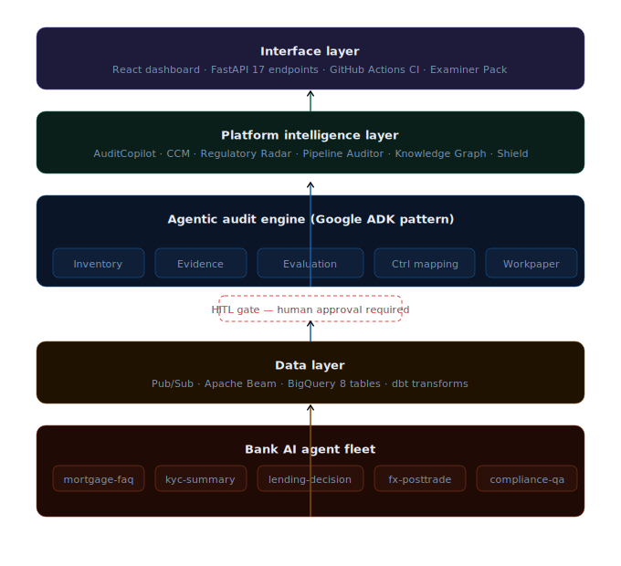

<div align="center">

# ThirdLine
### Agentic AI Audit and Governance Platform

*The Third Line of Defense for the era of AI agents.*

[](https://python.org)
[](https://fastapi.tiangolo.com)
[](https://react.dev)
[](https://cloud.google.com)
[](https://openai.com)

</div>

---

## Why This Exists

In April 2026, regulators published SR 26-2 and OCC Bulletin 2026-13 and quietly carved agentic AI systems **out** of traditional model risk scope.

Banks are deploying hundreds of AI agents into production: mortgage advisors, KYC summarizers, lending decision assistants, compliance Q&A bots. These agents hallucinate. They leak PII. They can be prompt-injected. They drift silently. They treat customer groups differently.

**And nobody is auditing them.**

Traditional model risk frameworks were built for statistical models, not for GPT-4o agents that reason, retrieve, and act. Internal audit teams have no tooling. Regulators have no playbook yet. The governance gap is real, growing, and it opened in April 2026.

ThirdLine is the answer: **an AI system that autonomously audits other AI systems**, detecting failures, mapping them to regulatory controls, enforcing human sign-off, and producing examiner-ready evidence.

---

## System Architecture



Five layers, each with a distinct responsibility:

| Layer | What it does |
|-------|-------------|
| **L1 Bank agents** | 5 GPT-4o-mini agents with injected defects, the subjects under audit |
| **L2 Data** | Pub/Sub to Beam to BigQuery, dbt transforms, 8 tables |
| **L3 Audit engine** | Orchestrator plus 5 specialist sub-agents, HITL gate enforced architecturally |
| **L4 Intelligence** | AuditCopilot, CCM, Regulatory Radar, Pipeline Auditor, Knowledge Graph, Shield |
| **L5 Interface** | FastAPI 17 endpoints, React dashboard, GitHub Actions CI, Examiner Pack |

---

## The 6-Step Audit Pipeline

```
DISCOVER  ->  COLLECT  ->  EVALUATE  ->  MAP  ->  DRAFT  ->  HITL GATE  ->  LEDGER
Fleet scan    Pull logs    5 dims        Controls  Workpaper  Hard stop       SHA-256
```

The orchestrator follows a structured 6-step plan using the Google ADK pattern. At the HITL Gate, the pipeline stops completely. The orchestrator cannot self-approve. A human auditor must act via the API before any finding is finalised.

---

## Detection Performance

| Mode | Precision | Recall | F1 | Defects caught |
|------|-----------|--------|----|---------------|
| Deterministic evaluation | 83.3% | **100%** | **0.909** | 5 of 5 |
| Real GPT-4o-mini end-to-end | 38.5% | **100%** | 0.556 | 5 of 5 |

Recall is 100% in both modes. Every injected defect was caught.

The F1 difference is documented in ThirdLine's own model card: PSI-based drift detection is miscalibrated for real LLM output length variance. ThirdLine caught this by auditing itself. A governance system that hides its own limitations is not trustworthy.

---

## The 5 Evaluation Dimensions

| Dimension | What it catches | Detection method | Result |
|-----------|----------------|-----------------|--------|
| Hallucination | Fabricated facts not in context | LLM-as-judge (GPT-4o-mini) + signature matching | 5 caught |
| Bias | Disparate impact across proxy groups | 4/5ths rule, disparate impact ratio = 0.34 | 1 caught |
| Drift | Silent quality degradation over time | Population Stability Index, PSI > 0.20 threshold | 1 caught |
| Robustness | Prompt injection, jailbreak attacks | Automated red-team payload suite | 5 caught |
| Reliability | PII leakage, task failure | Regex PII detection + completeness scoring | 5 caught |

---

## Platform Intelligence Layer

### ThirdLine Shield

Real-time inference guardrail sitting in front of every agent. 5 input checks before the LLM, 2 output checks before the response. Latency under 2ms. Blocked requests never reach the model.

```
User query -> [injection / PII / scope / harmful / rate-limit] -> Agent LLM
                                                                       |
Safe response <- [PII in output / system prompt leak] <-----------[output]
```

### AuditCopilot

Natural language interface to the audit warehouse. Auditors type plain-English questions and get cited answers from real data.

```
"Which agents have CRITICAL findings?"
-> compliance-qa (score 11.0), kyc-summary, mortgage-faq

"Which control has the most violations?"
-> CTRL-004 with 4 findings

"What is the hallucination rate for the mortgage agent?"
-> 5 failures out of 50 evaluations, avg score 0.712
```

### Regulatory Radar

Monitors Federal Reserve, OCC, FDIC, and CFPB for new AI governance guidance. When new rules drop, ThirdLine auto-maps them to its control library and flags which approved findings need re-evaluation.

Current alerts: SR 26-2 (HIGH, CTRL-001/002/003), OCC Bulletin 2026-13 (HIGH, CTRL-001/006), CFPB Circular 2026-03 (MEDIUM, CTRL-002).

### Knowledge Graph

35-node graph connecting agents, findings, controls, business lines, and risks. Enables systemic risk queries flat tables cannot answer.

- "Which business line has the highest AI risk?" Compliance, score 17.0
- "Which agent is the highest risk?" compliance-qa, score 11.0
- "Which control has the most failures?" CTRL-004, 4 findings

### Validate the Validator

ThirdLine applies its own 5-dimension framework to itself. Generates a model card. Reports its own false positive rate. Because an AI governance system that cannot govern itself is not production-ready.

### Examiner Pack

One function call generates a complete regulatory evidence package: agent inventory, risk scorecards, findings with evidence citations, human approval trail, ledger extract, SHA-256 integrity hash on the entire document. Ready to hand to an OCC or Fed examiner.

---

## Engineering Highlights

```python
# HITL is an architectural constraint, not a convention.
# The orchestrator literally cannot proceed without human approval.
def _step_hitl_gate(self, findings, run_id):
    for finding in findings:
        entry = {
            "status": "PENDING",   # Only a human API call can change this
            "sla_deadline": ...,   # CRITICAL = 4hr, HIGH = 24hr
        }
        queue_dir.write(entry)
    return queue_entries   # Pipeline stops. Human must act.
```

```python
# Eval-as-test: CI fails if ThirdLine's own F1 drops below 0.70.
# Detection quality is a first-class engineering constraint.
if f1 < threshold:
    print(f"FAIL: F1 {f1:.3f} below threshold {threshold}")
    sys.exit(1)   # Blocks the merge
```

```python
# Hash-chained ledger: tamper-evident, append-only.
chain_hash = SHA256(prev_hash + finding_hash)
# Modify any historical entry and the chain breaks. Detected immediately.
```

---

## Regulatory Alignment

| ThirdLine Feature | SR 26-2 / OCC 2026-13 Principle |
|-------------------|---------------------------------|
| 5-dimension evaluation | Conceptual soundness, ongoing monitoring |
| HITL gate (architectural) | Effective challenge, human oversight |
| Hash-chained ledger | Documentation, audit trail |
| Control mapping CTRL-001 to 006 | Risk identification and assessment |
| ThirdLine Shield | Risk mitigation, real-time controls |
| Validate the Validator | Independent validation of AI systems |
| Regulatory Radar | Keeping pace with evolving guidance |
| Examiner Pack | Examiner-ready evidence documentation |

---

## Tech Stack

| Layer | Technologies |
|-------|-------------|
| AI / LLM | GPT-4o-mini (agents + judge), LangGraph, Google ADK pattern, RAG, ChromaDB |
| Backend | Python 3.11, FastAPI, Pydantic, Uvicorn, structlog |
| Data | GCP BigQuery, dbt Core, Apache Beam, Pub/Sub, DuckDB |
| Infrastructure | GCP, Terraform, Cloud Run, Vertex AI, GitHub Actions, AWS (prev. deployment) |
| Frontend | React 18, TypeScript, Tailwind CSS, Vite |
| Evaluation | LLM-as-judge, PSI drift detection, Disparate impact ratio, Red-team suite |

---

## API Endpoints (17 total)

```
GET  /api/v1/agents                      Fleet inventory with risk status
GET  /api/v1/agents/{id}                 Agent detail and dimension scorecards
GET  /api/v1/findings                    All audit findings (filterable)
GET  /api/v1/review-queue                HITL queue
POST /api/v1/review-queue/{id}/approve   Human approves finding and records to ledger
POST /api/v1/review-queue/{id}/reject    Human rejects finding and records to ledger
GET  /api/v1/ledger                      Audit ledger and chain verification
GET  /api/v1/metrics                     F1, precision, recall
POST /api/v1/shield/check                Test Shield on any prompt
GET  /api/v1/shield/stats                Shield block and allow statistics
POST /api/v1/validate-validator          Self-audit ThirdLine
POST /api/v1/examiner-pack               Generate regulator PDF
POST /api/v1/copilot/ask                 Natural language audit query
GET  /api/v1/ccm/status                  CCM monitoring status
POST /api/v1/regulatory-radar/scan       Scan Fed/OCC/FDIC for new guidance
GET  /api/v1/knowledge-graph/report      Systemic risk report
GET  /api/v1/knowledge-graph/query       Graph query
```

---

## Quick Start

```bash
git clone https://github.com/YOUR_USERNAME/thirdline.git
cd thirdline
python -m venv venv && source venv/bin/activate
pip install -r requirements.txt

# Add OPENAI_API_KEY to config/.env
cp config/.env.example config/.env

# Run the full pipeline
python scripts/run_fleet.py         # Generate 250 interactions
python scripts/run_audit.py         # 6-step audit pipeline
python scripts/meta_eval.py         # Compute F1 / precision / recall

# Start API and dashboard
python scripts/run_api.py           # Terminal 1 - localhost:8000/docs
cd frontend && npm install && npm run dev  # Terminal 2 - localhost:5173

# Run all advanced features
python scripts/run_week1_features.py     # Shield, Validator, Examiner Pack
python scripts/run_week2_3_features.py  # Copilot, CCM, Radar, Graph
```

---

## Project Structure

```
thirdline/
  agents_under_audit/     5 GPT-4o-mini bank agents + ground truth labels
  assurance_agents/       Orchestrator + 5 specialist sub-agents (ADK)
  audit_copilot/          Natural language audit interface
  ccm/                    Continuous Controls Monitoring
  config/                 Settings, environment
  data_engineering/       BigQuery DDL, dbt models, Beam pipeline
  evaluation/             5-dimension engine, rubrics, red-team payloads
  examiner_pack/          Regulator-ready PDF generator
  governance/             Control catalog, model cards, self-audit
  infra/terraform/        GCP infrastructure as code
  knowledge_graph/        Systemic risk graph (35 nodes, 44 edges)
  regulatory_radar/       Fed/OCC/FDIC guidance monitor
  thirdline_shield/       Real-time inference guardrail
  data_pipeline_auditor/  Upstream data quality (6 checks)
  api/main.py             FastAPI - 17 endpoints
  frontend/               React + TypeScript + Tailwind dashboard
  .github/workflows/      CI/CD with eval-as-test quality gate
```

---

<div align="center">

**Built by Aastha Joshi**
MS Information Systems, SDSU. Research Assistant, Agentic AI Systems.

ThirdLine was built to fill a governance gap that opened in April 2026.
It is the audit infrastructure that regulated institutions need and do not yet have.

</div>
